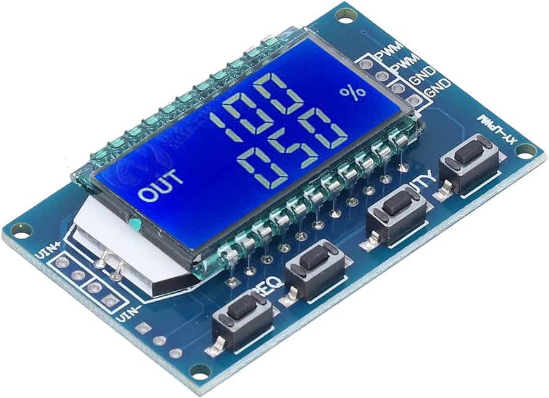

# Testing & Development

Pull requests are welcomed! Please [visit GitHub](https://github.com/steadramon/ESPGeiger) if you would like to contribute to the project.

## Pulse Testing

PWM modules like the above have come in handy whilst developing the counting logic.
