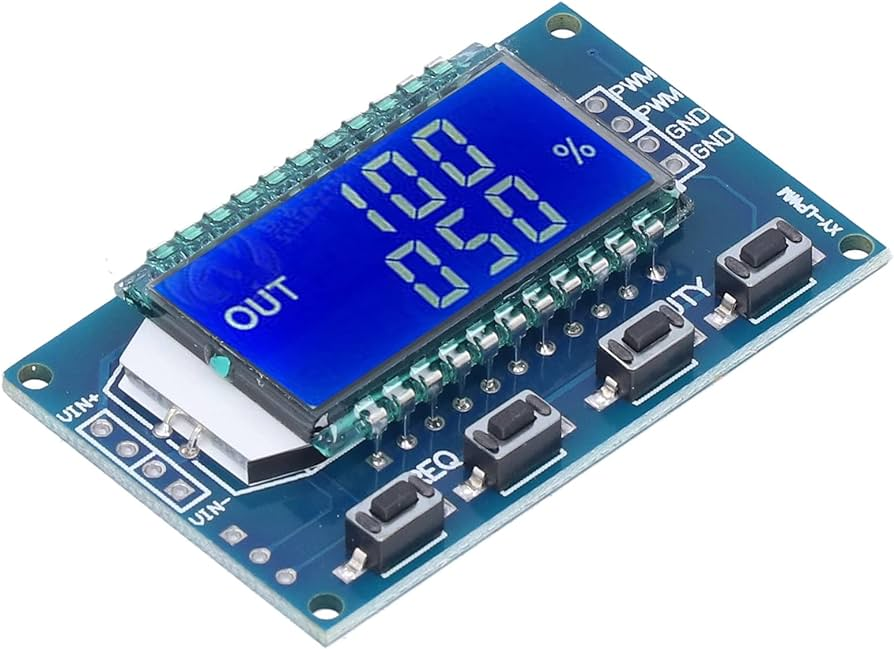

# Testing & Development

Pull requests are welcomed! Please [visit GitHub](https://github.com/steadramon/ESPGeiger) if you would like to contribute to the project.

## Pulse Testing



PWM modules like the above have come in handy whilst developing the counting logic.

# Test Builds

ESPGeiger offers test builds specifically designed for ESP8266 and ESP32 microcontrollers. These builds enable the device to emulate various Geiger counter functionalities:

- __Pulse Counter__: Simulates the detection of radiation events by outputting a set number of pulses on the `TXPIN`
- __GC10 Serial Counter__: Emulates a GC10 Geiger counter, transmitting simulated radiation counts through the serial interface on the `TXPIN`
- __MightOhm Serial Counter__: Mimics a MightOhm Geiger counter, providing simulated radiation data in a MightOhm-compatible format via the serial port on the `TXPIN`

Simulated values follow a Poisson distribution, mimicking the random nature of real radioactive decay.

By default the Test output cycles through several ranges of reading, switch each 5 minute period:

- 0.5 CPS / 30 CPM
- 1 CPS / 60 CPM
- 1.66 CPS / 100 CPM
- 2 CPS / 120 CPM

A build option is available to count the number of CPM sent on the local device, note that if this option is enabled and the `RXPIN` and `TXPIN` of the same device are connected together, counted values will be doubled *unless the debounce window filters the duplicate* — see below.

## Emulation and Communication

In these test build modes, you can connect the `TXPIN` (transmit pin) of one ESPGeiger device to the `RXPIN` (receive pin) of another ESPGeiger device, either the same unit or a different one. This setup allows you to create a closed-loop testing environment, mimicking real-world Geiger counter communication scenarios.

### TestPulse → esp8266_pulse cross-device setup

To sanity-check the end-to-end count pipeline, wire a `*_testpulse` device's TX pin (default GPIO 12 on ESP8266, configurable via the Input preferences) to an `esp8266_pulse` device's RX pin (default GPIO 13), and share GND between the two boards. Both devices then post to the WebAPI independently and their CPM readings should agree within Poisson noise.

Notes:

- Idle line level is LOW; each simulated count is a ~500µs HIGH pulse. The receiver counts on the falling edge at pulse end. This is inverted-polarity from a real Geiger tube (idles HIGH, pulses LOW) but the count is the same.
- `GEIGER_COUNT_TXPULSE` is enabled in the default builds, so the transmitting device also counts its own outgoing pulses internally. On a bridged TX↔RX of the *same* device this would double-count except that the receiver-side `debounce` filter (default 500µs) drops the duplicate edge that arrives immediately after.

### Pushing the rate ceiling

Default settings give a practical ceiling of roughly 120k CPM on both sides:

- TX side: `pulse_width_us` pref sets the simulated pulse high-time (default 500µs). Below the pulse width, the Poisson inter-arrival sampler saturates rather than producing overlapping pulses — the long-run rate is Poisson-correct up to that floor, then plateaus.
- RX side: `debounce` pref discards edges arriving closer than its value (default 500µs).

To stress-test beyond 120k CPM:

1. Lower `pulse_width_us` on the transmitting device (e.g. 100µs → ~600k CPM ceiling).
2. Lower `debounce` on the receiving device to match or beat the new pulse cadence.
3. Optionally set `GEIGER_TEST_FIXEDCPM` or use the `--manual` CPM setter so you're testing a specific rate rather than the rotating 30/60/100/120.

The `*_testpulseint` variant uses a deterministic PWM (not Poisson) and scales cleanly to ~500k CPM without these knobs — useful when the goal is "does the counter keep up?" rather than "does the statistics look right?".

### Test build variants at a glance

| Build | Counting mechanism | Statistics | Max practical CPM |
|---|---|---|---|
| `*_test` | Poisson ISR, no GPIO | Real Poisson | ~120k (debounce auto-zeroed on this variant) |
| `*_testpulse` | Poisson ISR + real GPIO pulses | Real Poisson | ~120k default, higher with `pulse_width_us` lowered |
| `*_testpulseint` | Uniform PWM | Deterministic (not Poisson) | 500k+ |
| `*_testserial` | Per-second integer Poisson sampler + serial protocol | Real Poisson | not physically bounded |

### TestSerial TX↔RX self-loopback is limited to 9600-baud protocols

Bridging TX to RX on the same `*_testserial` device for a self-loopback sanity check works cleanly for **GC10** and **MightyOhm** (both 9600 baud) — you'll see matching `TestSerial TX:` and `TestSerial RX:` lines in the log as the codec round-trips.

For **GC10Next** and **ESPGeiger** (both 115200 baud) the self-loopback is unreliable. `EspSoftwareSerial` bit-banging *both* directions on one chip at 115200 (8.7µs per bit) collides with WiFi / MQTT / loop() CPU work, so the frames corrupt in transit and the parser rejects them. `TestSerial TX:` still shows the correct outgoing line, but no matching `TestSerial RX:` line appears.

This is a SoftwareSerial limitation, not a codec bug — the same `SerialFormat::parse_cpm` round-trips cleanly at 9600, so we know the format/parse pair is symmetric by construction. Real hardware counters emitting to our SoftwareSerial RX at 115200 work fine because their hardware UART has precise bit timing; only the self-loopback scenario hits the limit.

To validate the 115200 path specifically, either run TestSerial on one ESP8266 wired to a *second* ESP8266 running real `GeigerSerial`, or trust the 9600 round-trip as evidence of codec correctness.

_Note_: No values are submitted to public services with Test builds.

## Tick Profiling

For diagnosing performance issues in the 1Hz tick callback, add `-DTICK_PROFILE` to `build_flags` in your environment config. Once per minute the device logs a breakdown of where time is spent:

```
Tick profile: total=425 ctr=230 wifi=109 mods=128 lps=58733
Mods max: mqtt=61 sdcard=25
```

- `total` — worst single tick duration in the last 60 seconds (us)
- `ctr` — max time in `gcounter.secondticker()`
- `wifi` — max time in WiFi tracking block
- `mods` — max total time in `EGModuleRegistry::tick_all()`
- `lps` — loop iterations per second (steady-state health indicator)
- `Mods max:` — per-module worst-case `s_tick` duration, slowest first

Zero overhead when the flag is not defined — all instrumentation compiles out.