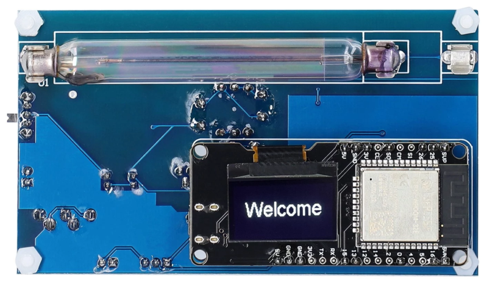
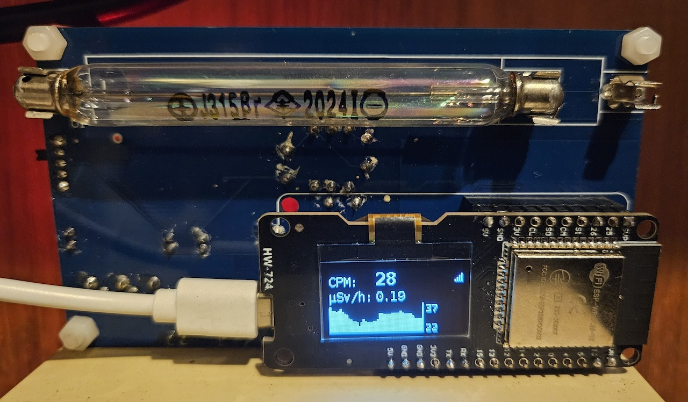

# Cajoe GC-ESP32 - IoT Geiger Counter

---

ESPGeiger is compatible with the Cajoe GC-ESP32 (IOT-GM), providing a custom firmware - extending the existing functionality with all of the additional features of ESPGeiger.

The Cajoe GC-ESP32 has a inbuilt ESP32 to which ESPGeiger can be installed. The ESP32 does not have a function in the running of the Cajoe geiger counter, this is very similar to a classic Cajoe counter, with the main counter circuit being independent from the ESP32.

## Disclaimer

{: .highlight }

>Please ensure you take a back up of the original firmware from the Cajoe GC-ESP32 in case you want to restore the original firmware.

## Install

- Follow the instructions for [installing ESPGeiger](/install/webinstaller) using the web installer at [https://install.espgeiger.com](https://install.espgeiger.com)

# User Images

## CAJOE GC-ESP32

 Image credit: [shyrwall](https://github.com/shyrwall)
