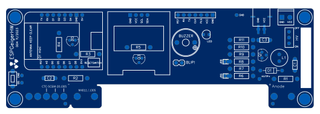

# ESPGeigerHW
{: .no_toc }

  

    Table of contents
  

  {: .text-delta }
- TOC
{:toc}

---

{: .text-center }

## Features

- ESP8266 MCU based Geiger Counter
- Low 5V power requirements
- Compatible with numerous Geiger-Muller tubes
- High Voltage circuit adjustment and feedback
- OLED display
- Integrated light and audio feedback

## Compatible Geiger Muller Tubes

The ESPGeigerHW Geiger counter supports multiple different Geiger Muller Tubes. The hardware features adjustable mounting positions for tubes with the following lengths:

- Position 1: 85mm - 95mm ± 2.0
- Position 2: 100mm - 110mm ± 2.0
- Position 3: 110 - 115mm ± 2.0

The board also has additional jumpers for connecting tubes that aren't directly mountable.

The high-voltage circuit is tested reliable for tubes requiring up to 400V operation.

The following commonly available tubes are known to be compatible with the ESPGeigerHW Geiger counter

| Tube Name | Length | Operating Voltage | Ratio | Notes |
|---|---|---|---|---|
SBM-20 (СБМ-20) | 108 ± 3.5 | 400V | - | 
SBM-19 (СБМ-19) | 195mm | 400V | - | 
STS-15 (CTC-15) | 111mm | 390-400V | - | 
J305 | 105mm | 400V | - | 
J305 | 90mm | 400V | - | 
M4011 | 90mm | 400V | - | 
ROBOTRON 70 013 | 163mm | 500V | 600 / 0.001667 | 