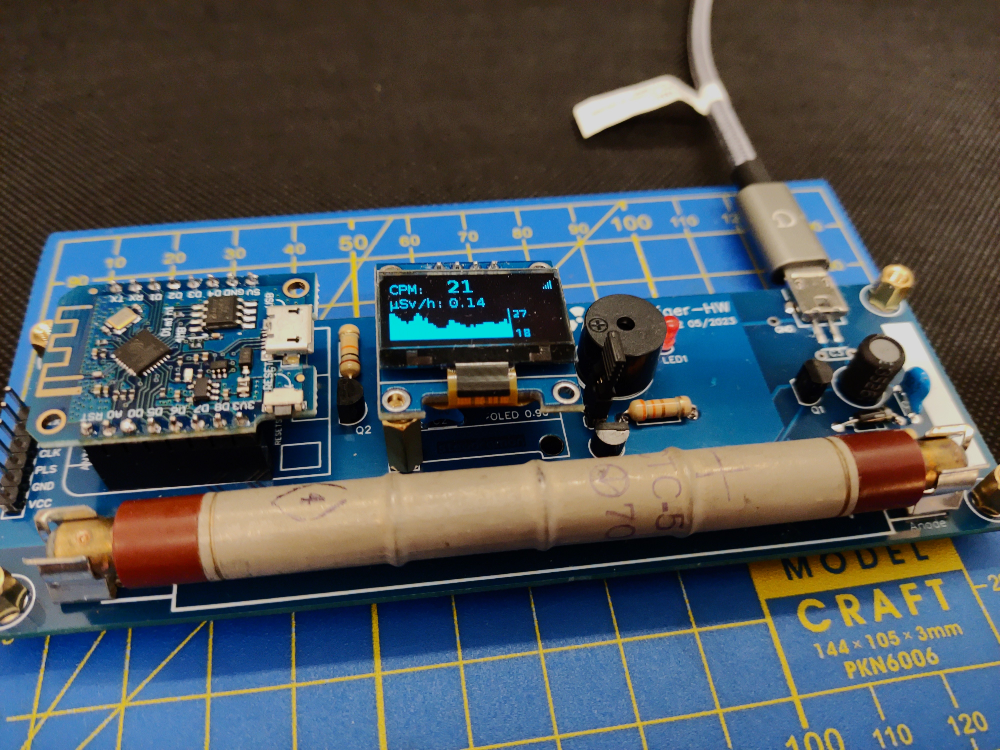
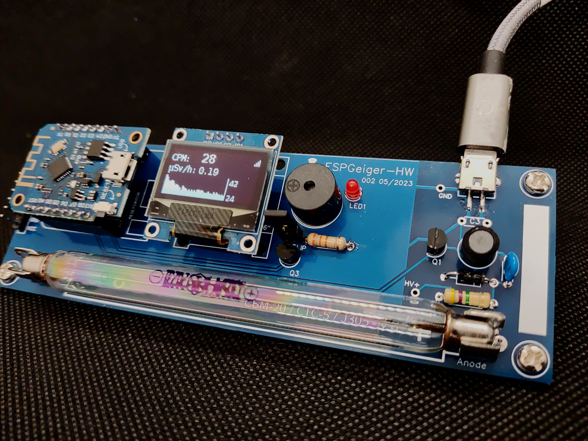

# ESPGeigerHW
{: .no_toc }

  

    Table of contents
  

  {: .text-delta }
- TOC
{:toc}

---

{: .text-center }

ESPGeigerHW is a fully featured, WiFi connected Geiger Counter powered by ESPGeiger.

## Disclaimer

{: .highlight }

>This evaluation board/kit is intended for use for __ENGINEERING DEVELOPMENT, DEMONSTRATION, OR EVALUATION PURPOSES ONLY__ and is not considered to be a finished end-product fit for general consumer use. Persons handling the product(s) must have electronics training and observe good engineering practice standards. As such, the goods being provided are not intended to be complete in terms of required design-, marketing-, and/or manufacturing-related protective considerations, including product safety and environmental measures typically found in end products that incorporate such semiconductor components or circuit boards.

## Features

- ESP8266 MCU based Geiger Counter
- Compatible with various Geiger-Muller tubes
- 5V power requirements
- On-board High Voltage boost circuit
- High Voltage circuit adjustment and feedback
- OLED display (SSD1305 0.96-inch 128x64)
- Integrated status LEDs and audio feedback
- Open Source firmware

## Technical Specification

- Supply Voltage: 5V DC
- Supply Current: 130mA with WiFi at background
- 2.4GHz WiFi

## Technical Notes

- Please use a reliable 5V DC supply. Whilst the overall power requirement is low, a stable 5V is required for the High Voltage circuit.

A project box or enclosure is highly suggested. Do not to touch any conductive region to the right of, or below, the OLED display when the Geiger tube is powered ON. An enclosure is not absolutely necessary, but if you choose not use an enclosure, remember to be extra careful with the high voltage regions.

## Compatible Geiger Muller Tubes

The ESPGeigerHW Geiger counter supports a number of different Geiger Muller Tubes. The hardware features adjustable mounting positions for tubes with the following lengths:

- Position 1 (removable tab): 85mm - 95mm ± 2.0
- Position 2: 100mm - 110mm ± 2.0
- Position 3: 110 - 115mm ± 2.0

The board also has additional jumpers for connecting tubes that aren't directly mountable.

The high-voltage circuit is tested reliable for tubes requiring up to 400V operation.

The following commonly available tubes are known to be compatible with the ESPGeigerHW Geiger counter

| Tube Name | Length | Operating Voltage | Ratio | Notes |
|---|---|---|---|---|
SBM-20 (СБМ-20) | 108 ± 3.5 | 400V | - | 
SBM-19 (СБМ-19) | 195mm | 400V | - | External connection
STS-15 (CTC-15) | 111mm | 390-400V | - | 
SI22G (СИ22Г) | 220mm | 390-400V | - | External connection
J305 | 105mm | 400V | - | 
J305 | 90mm | 400V | - | 
M4011 | 90mm | 400V | - | 
ROBOTRON 70 013 | 163mm | 500V | 600 / 0.001667 | External connection

### Possibly Compatible
{: .no_toc }

The following tubes should also be compatible but are currently untested

- LND-712 <https://www.lndinc.com/products/geiger-mueller-tubes/712/>/<https://www.pocketmagic.net/tube-lnd-712-end-window-alpha-beta-gamma-detector/>
- [LND-7312](https://www.lndinc.com/products/geiger-mueller-tubes/7312/)
- [SBT-9](https://www.pocketmagic.net/tube-sbt-9-end-window-geiger-tube/)
- [SBT-10A](https://www.pocketmagic.net/tube-sbt-10a-c%d0%b1t-10a/)
- [SBT-11A](https://www.gstube.com/data/3006/)
- [SI-180G](https://sites.google.com/site/diygeigercounter/technical/gm-tubes-supported)
- Philips 18504
- Beta-1
- Beta-2
- Gamma-7C

## Example Setups

### SBM-20

### STS-5

### J305 - 105mm

# Thanks

The hardware circuit is inspired by this article from January 2004 at [Nuts and Volts Magazine](https://www.nutsvolts.com/magazine/article/pocket-geiger-unit) and a number of other counters based around the same design.

Mentions also go to [Jeff Keyzer](https://mightyohm.com/) and [www.netiodev.com](http://www.netiodev.com) for general inspiration.

Special thanks goes to the following people for the help and advice during development of the hardware.

- [Jander](https://r.jander.me.uk/) 
- [SimoMax](https://radmon.org/index.php/forum/profile/344-simomax)
