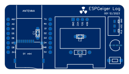
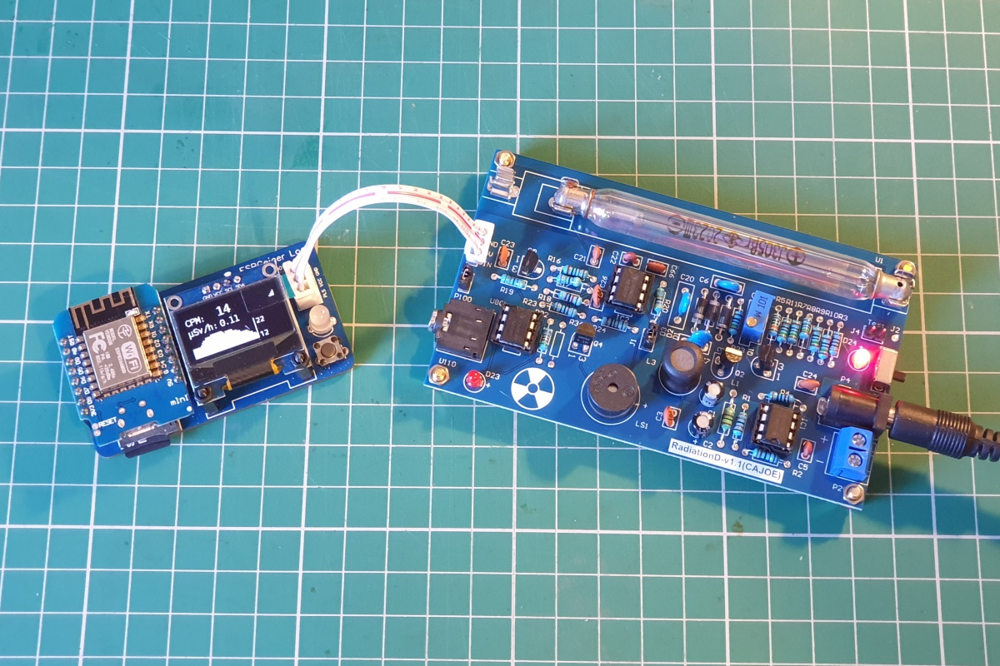
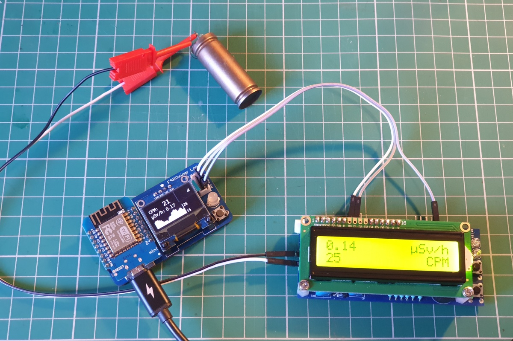
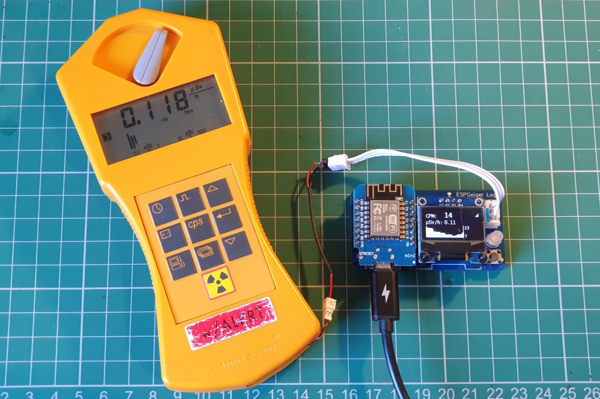

# ESPGeiger Log
{: .no_toc }

  

    Table of contents
  

  {: .text-delta }
- TOC
{:toc}

---

{: .text-center }

ESPGeiger Log is a hardware solution designed to seamlessly transform existing Geiger counters into Internet of Things (IoT) devices.

## Features

- ESP8266 MCU based Geiger counter logger
- Compatible with numerous Geiger counters - Pulse and Serial
- Intuitive coloured NeoPixel feedback
- OLED display (SSD1305 0.96-inch 128x64)
- SDCard logging
- Low Power Requirements (< 250mA @ 5v)

Note: Board version `001 12/2023` has positions for through hole components in positions `C1`, `C2` and `R1` - however these components are already in place as surface mounted components.

## Disclaimer

{: .highlight }

>This evaluation board/kit is intended for use for __ENGINEERING DEVELOPMENT, DEMONSTRATION, OR EVALUATION PURPOSES ONLY__ and is not considered to be a finished end-product fit for general consumer use. Persons handling the product(s) must have electronics training and observe good engineering practice standards. As such, the goods being provided are not intended to be complete in terms of required design-, marketing-, and/or manufacturing-related protective considerations, including product safety and environmental measures typically found in end products that incorporate such semiconductor components or circuit boards.

## Setup Information

The default firmware build provides Pulse based Geiger Counter functionality.

### Pin Information

The JST header exposes the following pins as marked on the silkscreen

| Label | Purpose | Description
|---|---|---|
`GND` | GND | Please always have a common ground between your Geiger Counter and the ESPGeiger Log
`VCC` | 5v In | It is possible with some setups to power the ESPGeiger Log from the Geiger Counter
`PLS` | Pulse Interrupt | Pulse Interrupt Pin

Please also see the additional information in the Outputs section of the documentation.

### CAJOE D1 Radiation Setup

It is possible to power the ESPGeiger Log directly from the CAJOE D1 Geiger Counter. The header layout on the board allows for a straight-through connection between the ESPGeiger Log and the CAJOE. See images below for example setups.

## Example Setups

Thanks goes to the users of ESPGeiger Log for their images

### CAJOE RadiationD

Image credit: [SimoMax](https://radmon.org/index.php/forum/profile/344-simomax)

### RH Electronics DIY Kit v2

Image credit: [SimoMax](https://radmon.org/index.php/forum/profile/344-simomax)

### Gamma Scout Alert (Modified)

Image credit: [SimoMax](https://radmon.org/index.php/forum/profile/344-simomax)
