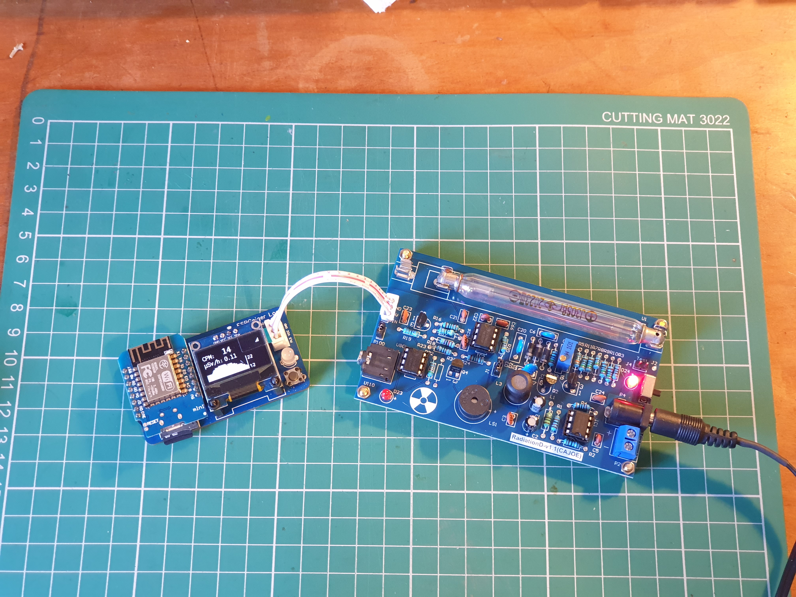
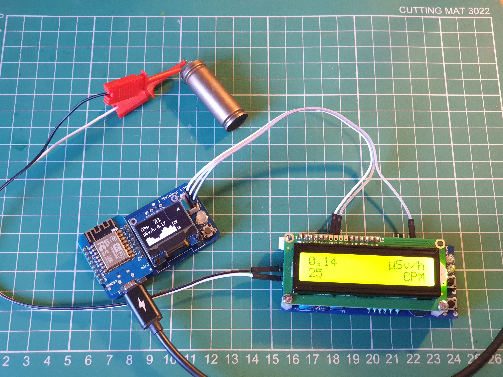
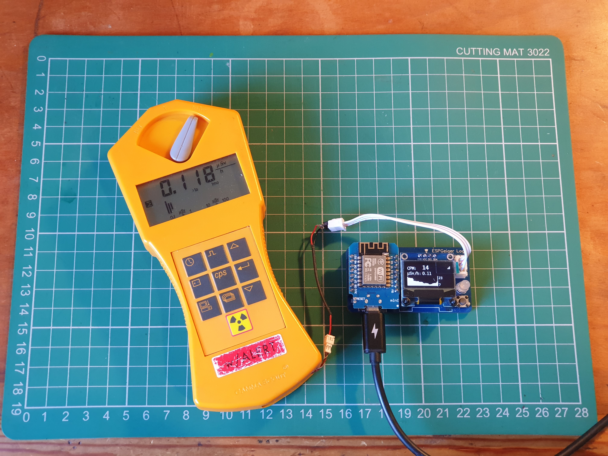

# ESPGeiger Log
{: .no_toc }

  

    Table of contents
  

  {: .text-delta }
- TOC
{:toc}

---

{: .text-center }

ESPGeiger Log is a hardware solution designed to seamlessly transform existing Geiger counters into Internet of Things (IoT) devices.

## Features

- ESP8266 MCU based Geiger counter logger
- Compatible with numerous Geiger counters - Pulse and Serial
- Intuitive coloured NeoPixel feedback
- OLED display (SSD1305 0.96-inch 128x64)
- SDCard logging

Note: Board version `001 12/2023` has positions for through hole components in positions `C1`, `C2` and `R1` - however these components are already in place as surface mounted components.

## Example Setups

Thanks goes to the users of ESPGeiger Log for their images

