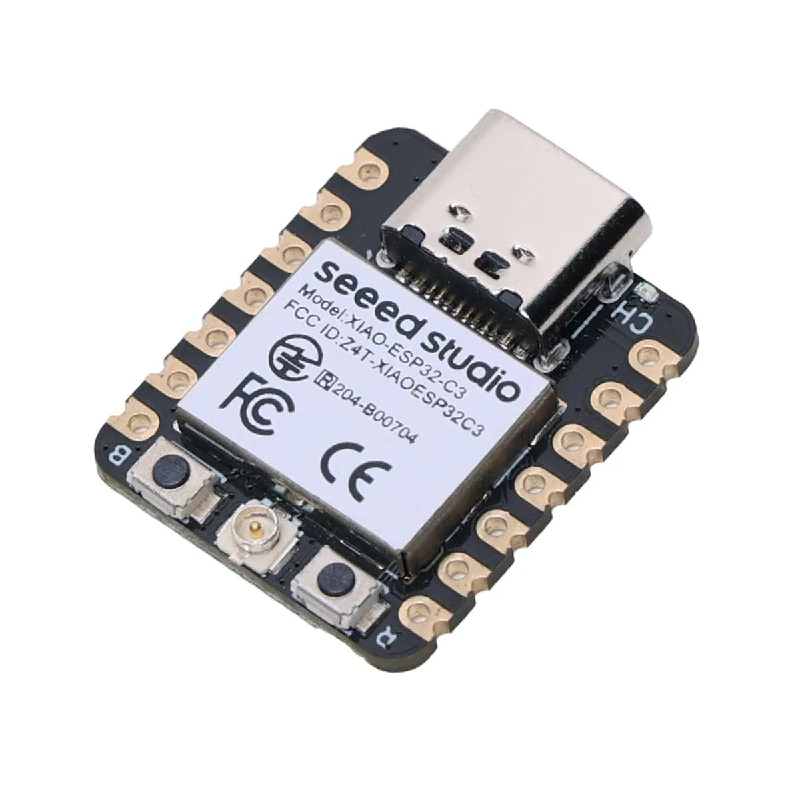
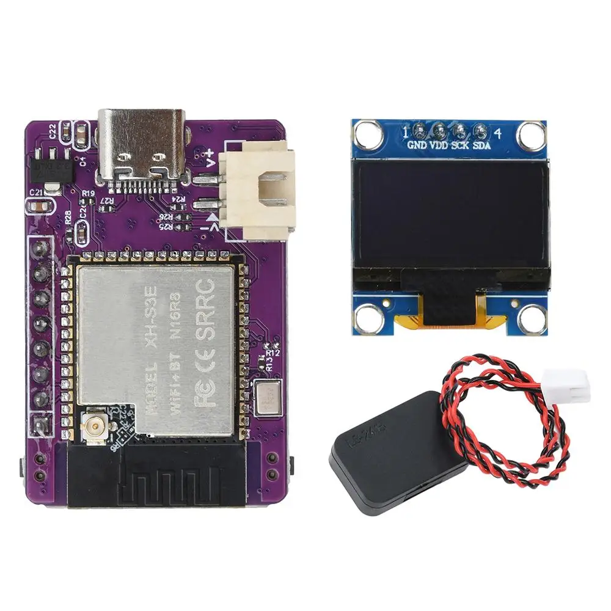

# ESPGeiger Compatible Hardware

ESPGeiger is written to be compatible with both the ESP8266 and ESP32 range of MCUs.

## ESP8266

The [Wemos D1 Mini](https://s.click.aliexpress.com/e/_DmfPg5L) (4MB) is the recommended ESP8266 MCU for ESPGeiger.

The ESP8266 ESPGeiger build is the base firmware for the official ESPGeiger-based hardware __ESPGeiger-HW__ and __ESPGeiger Log__.

## ESP32

### Classic

The **[ESP32 DevKit / WROOM-32](https://s.click.aliexpress.com/e/_c4MWYcBT)** (classic ESP32) is the recommended ESP32 target. Any 4 MB board built on the original ESP32 (Tensilica dual-core, IDF target `esp32`) should work with the `esp32_*` builds. ESP32 / ESP32-S3 / ESP32-C3 builds bundle SSD1306 OLED support and auto-detect the panel at boot, so the same env works whether or not a display is fitted.

### ESP-S3

For ESP32-S3, the **[ESP32-S3-WROOM-1 N16R8](https://s.click.aliexpress.com/e/_c40rZstr)** dev board (44-pin Type-C, 16 MB flash, 8 MB PSRAM, onboard NeoPixel on GPIO 48) is a target for the `esp32s3_*` builds.

### ESP-C3

For the **world's smallest ESPGeiger**, the **[Seeed Studio XIAO ESP32-C3](https://s.click.aliexpress.com/e/_c3OtwhXJ)** (21x17.5 mm, USB-C, BLE 5.0, external u.FL antenna) flashes cleanly with the `esp32c3_*` builds. Bare-minimum receiver: just power, an attached tube or upstream UDP feed, and you have a working monitor in a footprint that fits inside almost any enclosure.
<br>


Other variants and devboards for the ESP classic, C3 and S3 should all be supported. Most options are selectable runtime for various pins, OLED options, NeoPixel and LED.

### Variant support

| Variant | Status | Notes |
|---|---|---|
| **ESP32 (classic)** | Fully supported | All `esp32_*` build envs. PCNT hardware counter. SSD1306 OLED bundled and auto-detected. |
| **ESP32-S3** | Supported | Generic `esp32s3_pulse / _pulse_no_pcnt / _serial / _udp / _test` envs. Defaults match ESP32 classic: `_pulse_no_pcnt` is the safe interrupt-based build, `_pulse` uses the PCNT hardware counter (opt-in). SSD1306 OLED bundled and auto-detected. |
| **ESP32-C3** | Supported | `esp32c3_*` envs (RISC-V, no PCNT - software pulse counter). SSD1306 OLED bundled with default SDA=5 / SCL=6. |
| **ESP32-S2** | Experimental | Base config present, no shipped end-user envs. |
| **ESP32-C6 / H2** | Not supported | No build envs. RISC-V cores not tested. |

### Boards with onboard OLED

Several popular ESP32 / ESP8266 boards ship with an SSD1306 OLED soldered to the same PCB. ESP32 family envs bundle OLED support and auto-detect the panel; just set SDA / SCL (and RST if your board wires it) from the Config page after flashing. ESP8266 still uses dedicated `esp8266oled_*` builds.

| Board | MCU | OLED pins (SDA / SCL) | OLED RST | Build | Notes |
|---|---|---|---|---|---|
| **[NodeMCU + 0.96" OLED](https://s.click.aliexpress.com/e/_c3q9xiwZ)** | ESP8266 | 4 / 5 (default) | tied to 3V3 | `esp8266oled_*` | Works out of the box - matches firmware defaults. |
| **Heltec WiFi Kit 32 V2** | ESP32 classic | 4 / 15 | GPIO 16 | `esp32_*` | Set SDA=4 / SCL=15 / RST=16 from Config page after flashing. |
| **Heltec WiFi LoRa 32 V3** | ESP32-S3 | 17 / 18 | GPIO 21 | `esp32s3_*` | Set SDA=17 / SCL=18 / RST=21 from Config page after flashing. |
| **TTGO LoRa32 V1** | ESP32 classic | 4 / 15 | GPIO 16 | `esp32_*` | Same recipe as Heltec V2. |
| **LilyGo T-Beam** | ESP32 classic | 21 / 22 (default) | none | `esp32_*` | Works with stock defaults. |
| **[MINI ESP32-S3-N16R8](https://s.click.aliexpress.com/e/_c3dXGAQt)** (sold as "XH-S3E-AI"; small purple board, onboard speaker + mic + button + NeoPixel + OLED header) <br> | ESP32-S3 (16 MB flash, 8 MB PSRAM) | 41 / 42 (fixed) | none | `xh_s3e_*` | Dedicated env set; pin map hard-fixed in build flags. See [buildtargets](/install/buildtargets#audio-tick-esp32-only). |

Boards that wire the OLED's reset line to a GPIO (Heltec / TTGO) need the firmware to pulse that pin at boot. The `-DOLED_RST=N` build flag enables that pulse; if omitted, the OLED stays in reset and shows a blank screen. Once defined, the pin is also runtime-adjustable from **Config → Display → Reset Pin**.

If your board isn't listed but matches one of these patterns, the same recipe applies - set `OLED_SDA`, `OLED_SCL`, and `OLED_RST` (if relevant) in a custom build env.

### PCNT

The `ESP32` range of MCUs feature an in-built [hardware pulse counter](https://docs.espressif.com/projects/esp-idf/en/v5.4/esp32/api-reference/peripherals/pcnt.html) (`PCNT`). By default ESPGeiger uses the hardware PCNT on Pulse builds for ESP32 devices. A `no_pcnt` build is also available for ESP32 which uses the same Interrupt counter mechanism as the ESP8266 builds.

### PCNT Filter

The PCNT hardware includes a glitch filter that can ignore pulses shorter than a configurable threshold. This helps filter out electrical noise and interference that could otherwise be counted as false radiation events.

The filter value can be configured from the ESPGeiger web interface under __Config__. The value ranges from 0 to 1023, representing APB clock cycles at 80MHz (each unit = 12.5ns). A value of 0 disables filtering.

| Filter Value | Pulse Duration Filtered | Use Case |
|---|---|---|
| 0 | Disabled | No filtering |
| 100 (default) | < 1.25μs | Filters electrical noise while passing all real geiger pulses |
| 500 | < 6.25μs | More aggressive filtering for noisy environments |
| 1023 | < 12.8μs | Maximum filtering |

Real Geiger-Muller tube pulses are typically 50-200μs in duration, so even the maximum filter value will not affect real readings. The filter is only available on ESP32 PCNT builds.

The filter value can also be set at compile time with the `-D PCNT_FILTER=N` build flag. See [Build Options](/install/platformio#esp32-hardware-counter-pcnt) for details.

### Interrupt Debounce

On builds that use software interrupt counting instead of PCNT (all ESP8266 pulse builds, and ESP32 `no_pcnt` builds), a debounce window rejects any edge that arrives within a configurable number of microseconds of the previously accepted pulse. This serves the same purpose as the PCNT filter - suppressing electrical noise and contact bounce without affecting real tube pulses.

The debounce value can be configured from the ESPGeiger web interface under __Config__. The value is in microseconds, with a range of 0 to 10000. A value of 0 disables the debounce.

| Debounce Value | Pulses Rejected | Use Case |
|---|---|---|
| 0 | Disabled | No debounce |
| 200 (default) | < 200μs apart | Suppresses typical switching noise, passes all real pulses |
| 1000 | < 1ms apart | More aggressive for noisier setups |

Real Geiger-Muller tube dead time is around 50-200μs, so the default sits just below the tube's own recovery time and passes real events. The debounce only applies to the software interrupt path; PCNT builds use the PCNT Filter above instead.

The default can also be set at compile time with the `-D GEIGER_DEBOUNCE=N` build flag. See [Build Options](/install/platformio#geiger-counter-input) for details.

### Interrupt Saturation Guard

On the same software-interrupt builds, ESPGeiger watches the raw ISR-entry rate (pre-debounce) once a second. If it exceeds 10,000 entries/second (a level no physical Geiger tube can produce, but trivially reached by a floating RX pin, an unshielded cable picking up mains hum, or a failed tube oscillating) the firmware detaches the interrupt for 5 seconds and logs:

```
GeigerPulse: ISR storm (N/s) - parked 5s
```

The rest of the firmware (WiFi, web UI, MQTT, outputs) keeps running, so the device stays reachable and the watchdog gets fed. After 5 seconds the interrupt is reattached and counting resumes:

```
GeigerPulse: re-armed after storm cooldown
```

If the input is still saturated on re-arm, the guard parks it again. If you've just wired a real tube during the cooldown, counting picks up cleanly on the next re-arm.

The threshold is intentionally far above realistic radiation rates (typical strongest hand-held sources peak at ~1 kHz pulse rate) and is independent of the configured debounce, so it cannot be accidentally disabled by tuning. PCNT builds count edges in hardware without firing the ISR, so they don't need this guard.
