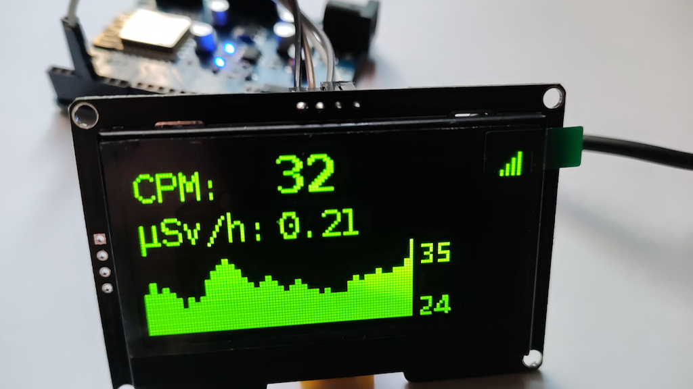

# OLED Displays

ESPGeiger supports cheap, widely-available I2C OLED panels for live readout of CPM, μSv/h, history graphs, and status. A small SSD1306 module slotted into an ESP8266 build adds a complete on-device UI for around $3-5.

## Supported chips

Set the chip type from **Config → Display → Display Type** (or build flag `-DOLED_TYPE=N`). All three options share the same 128×64 pixel resolution and I2C interface; they differ only in the panel driver IC.

| ID | Chip | Common form factor | Notes |
|---|---|---|---|
| `0` | **SSD1306** | 0.96" 128×64 | Default. The cheapest and most common. Tiny but very readable. |
| `1` | **SH1106** | 1.3" 128×64 | Larger panel, slightly nicer pixels. Bus address and command set differ subtly from SSD1306 - pick this if you bought a "1.3 inch OLED" and the screen looks garbled with the default setting. |
| `2` | **SSD1309** | 2.42" 128×64 | Big, clearly readable across a room. Less common, slightly more expensive. Same protocol as SSD1306 - the firmware drives it the same way. |

If a module arrives and the display looks wrong (wrong characters, half the screen missing, snow), try the other chip IDs - it's the most common "this OLED doesn't work" cause.

## Connection

Four pins: VCC, GND, SCL, SDA. The default I2C pin assignment for `nodemcuv2`-based ESP8266 builds is **SDA = GPIO 4 (D2)**, **SCL = GPIO 5 (D1)**. These are configurable per build via `-DOLED_SDA=N`/`-DOLED_SCL=N` build flags, and most builds also expose them as runtime prefs on the Config page (the exception is fixed-hardware builds like `espgeigerhw`, where the pins are blocked).

Power: 3.3 V (most modules work with either 3.3 V or 5 V VCC, since they have onboard regulators; but 3.3 V is safer and matches the ESP).

## Buying

Search terms that get you the right thing:

- **[0.96" I2C OLED 128x64 SSD1306](https://s.click.aliexpress.com/e/_c3u5P9N3)** - the default. White, blue, or yellow/blue dual-colour variants all work.
- **[1.3" I2C OLED 128x64 SH1106](https://s.click.aliexpress.com/e/_c31PFyYl)** - if you want a bigger screen.
- **[2.42" I2C OLED 128x64 SSD1309](https://s.click.aliexpress.com/e/_c4WsTkMd)** - for a really visible readout.

Stay away from SPI modules unless you're building custom hardware - ESPGeiger's display driver is I2C-only. Modules with **4 pins** (VCC/GND/SCL/SDA) are I2C; **7-pin** modules are SPI and won't work without rewiring.

## Disabling

Set `display.brightness = 0` to blank the panel without disconnecting it. To remove OLED support entirely from a custom build, omit the `-DSSD1306_DISPLAY` build flag (see [PlatformIO Build Options](/install/platformio)).
