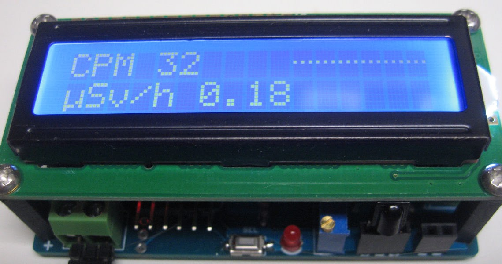
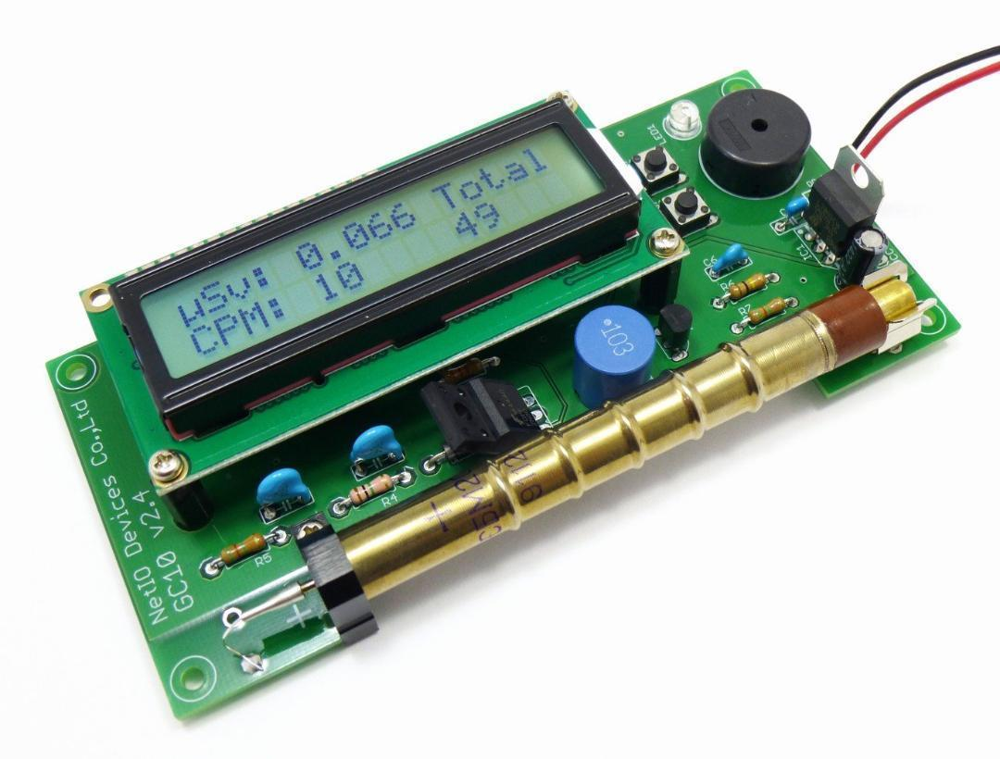
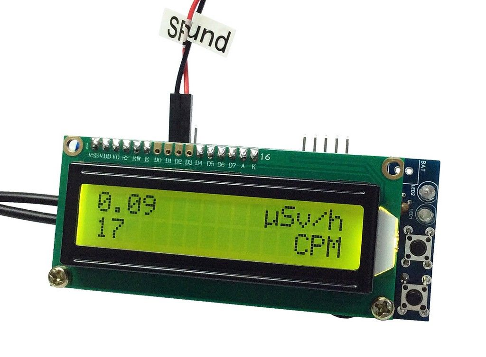
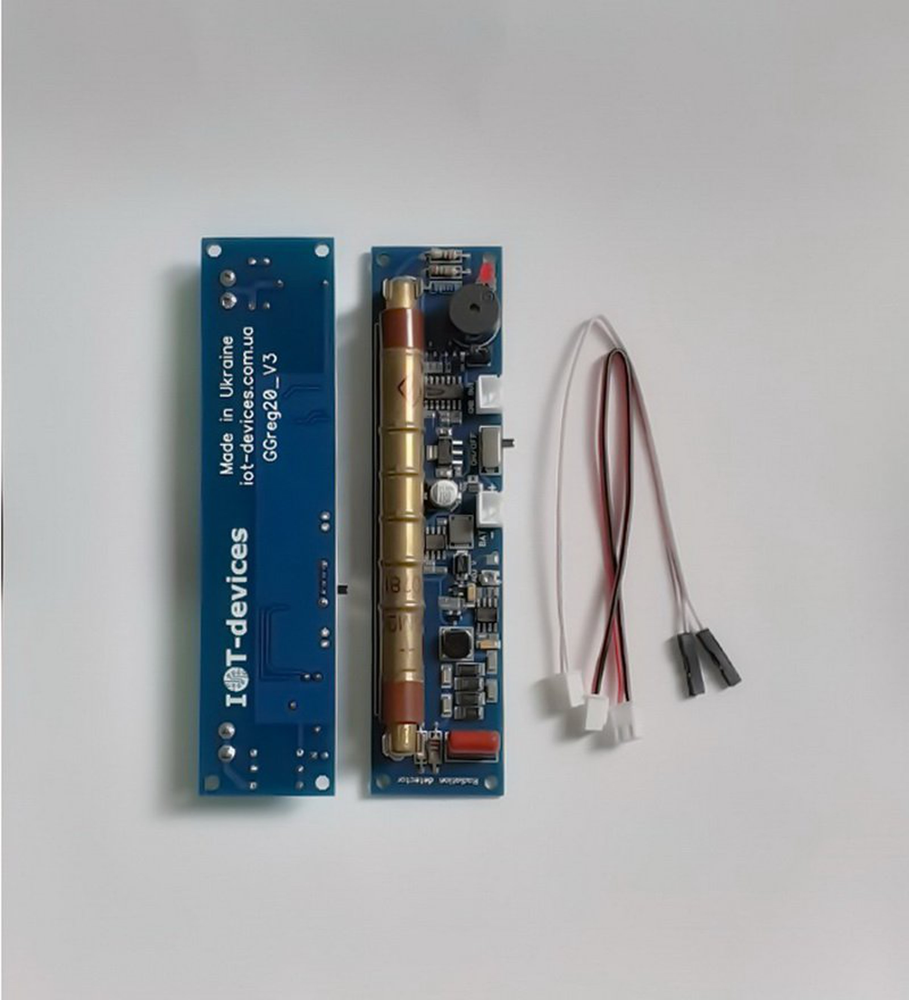
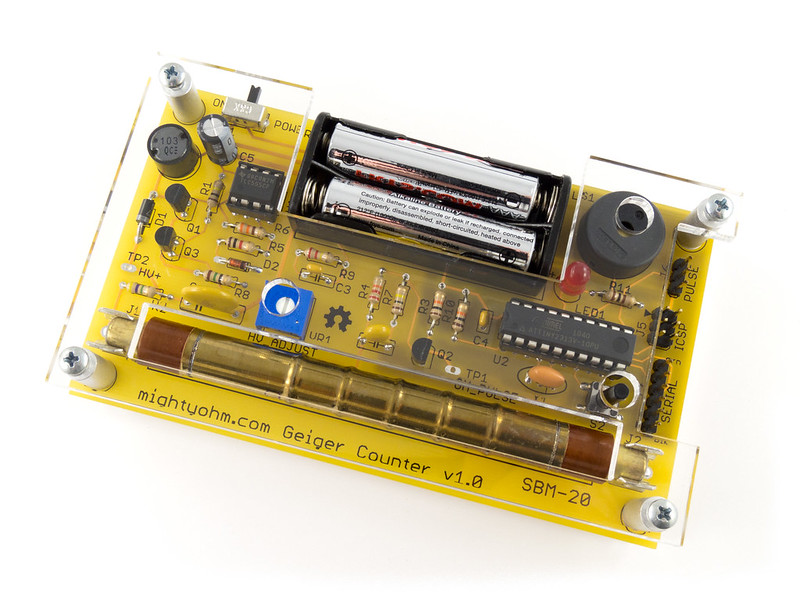
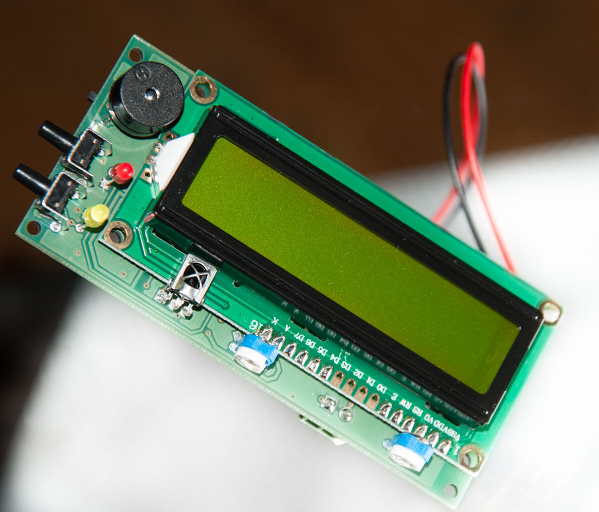
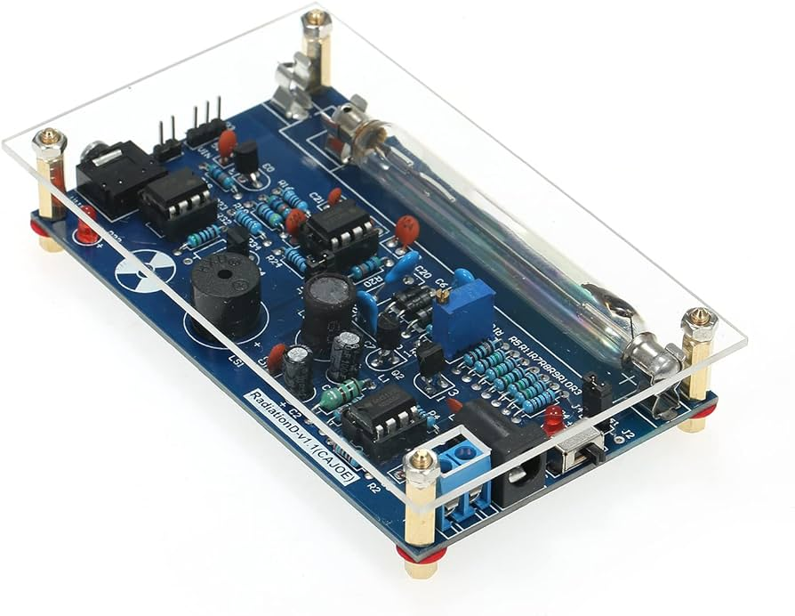

# Pulse Counters

The ESPGeiger firmware is designed to be compatible with any pulse based Geiger Counter that sends a I/O pulse for every count it detects.

| Counter | Image | Link |
|---|---|---|
DIY GeigerKit |  | https://sites.google.com/site/diygeigercounter
NetIO GC10 |  | https://www.ebay.co.uk/usr/pelorymate
RHElectronics Counters |  | https://www.rhelectronics.store/diy-geiger-counter-kit
GeigerHV | | https://www.ebay.co.uk/usr/geigerhv
GGreg20 |  | https://www.tindie.com/stores/iotdev/
MightyOhm Kit |  | https://www.tindie.com/stores/mightyohm/
DiY-GDC |  | https://www.ebay.com/usr/impexeris
CAJOE RadiationD-v1.1 (and other clones) |  |
