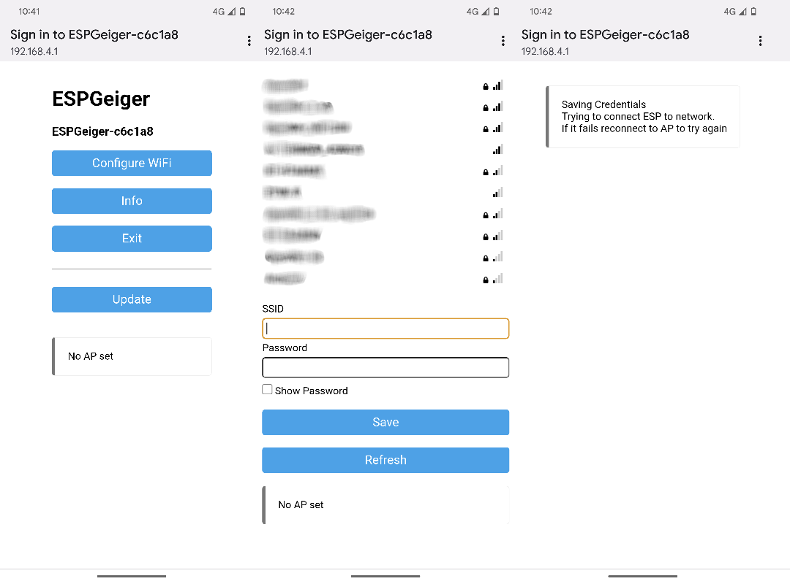

# Initial Setup

After first installation ESPGeiger requires configuring for connection to a WiFi network.

The ESPGeiger opens a local WiFi hotspot which allows the user to configure which WiFi network the ESPGeiger connects to.

Connecting to this WiFi hotspot should automatically show a configuration page.

Visiting [http://192.168.4.1/](http://192.168.4.1/) whilst connected to the hotspot will also show the configuration page.

To configure ESPGeiger for WiFi:

- Once connected, make a note of your ESPGeiger's ID - __ESPGeiger-XXXXXX__ this will be used to connect to the web interface.
- Click __Config Wifi__
- Select your Wifi Access Point from the list shown, OR
- Enter your SSID in the form area provided
- Enter your password in the form area provided
- Click Save

After a few seconds your ESPGeiger should be connected to your WiFi. 

You should now be able to browse to the ESPGeiger web interface to finish setup.

The ESPGeiger will be available on [http://ESPGeiger-XXXXXX.local](http://ESPGeiger-XXXXXX.local) - an alternate is to find the DHCP address given to the ESPGeiger in your routers web interface.
