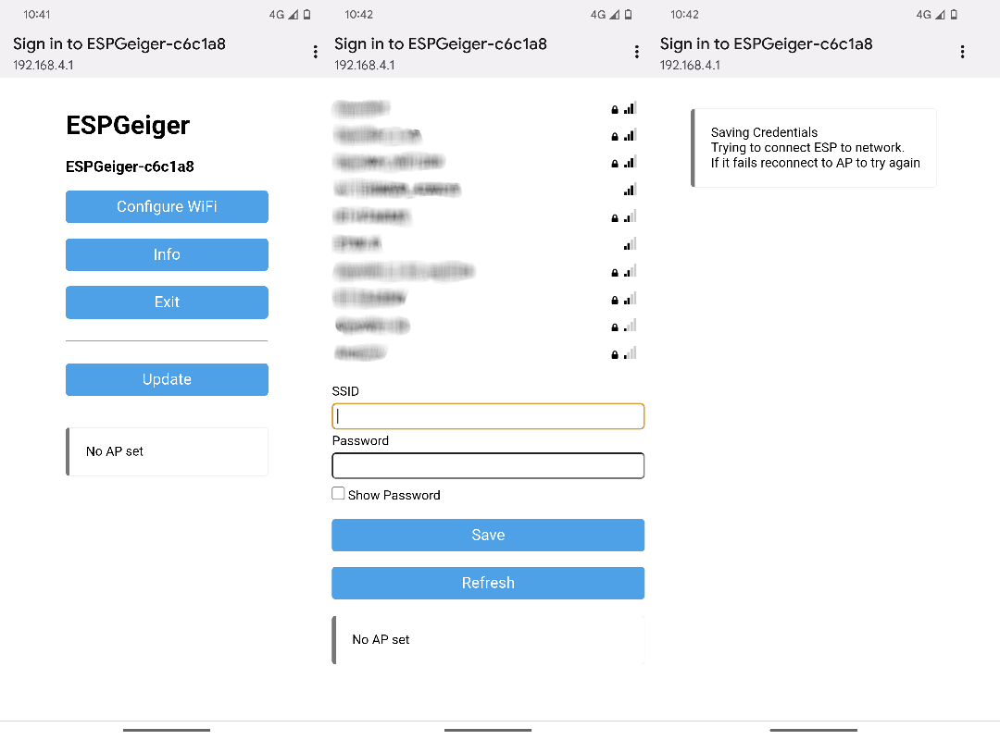

# Initial Setup



After first installation ESPGeiger requires configuring for connection to a WiFi network.

The ESPGeiger opens a local WiFi hotspot which allows the user to configure which WiFi network the ESPGeiger connects to.

Connecting to this WiFi hotspot should automatically show a configuration page.

Visiting [http://192.168.4.1/](http://192.168.4.1/) whilst connected to the hotspot will also show the configuration page.

> **Captive portal not appearing?** The automatic popup relies on DHCP-assigned DNS. If your device has a manual DNS server set (e.g. a pinned `1.1.1.1` or a local LAN DNS), the captive-portal detection probe fails silently because the DNS server isn't reachable from the ESPGeiger AP. Either switch that interface to DHCP-assigned DNS, or just browse to [http://192.168.4.1/](http://192.168.4.1/) directly - both work.

To configure ESPGeiger for WiFi:

- Once connected, make a note of your ESPGeiger's ID - __ESPGeiger-XXXXXX__ this will be used to connect to the web interface.
- Click __Config Wifi__
- Select your Wifi Access Point from the list shown, OR
- Enter your SSID in the form area provided
- Enter your password in the form area provided
- Click Save

After a few seconds your ESPGeiger should be connected to your WiFi. 

You should now be able to browse to the ESPGeiger web interface to finish setup.

The ESPGeiger will be available on [http://ESPGeiger-XXXXXX.local](http://ESPGeiger-XXXXXX.local) - an alternate is to find the DHCP address given to the ESPGeiger in your routers web interface.

## Locked out of the web UI?

If you set a web password (Config &rarr; System &rarr; Web password) and have forgotten it, the device's main web pages will keep prompting you for credentials. The password is stored on the device, not in the cloud, so there is no remote reset. There are three ways to recover, in order of least to most disruptive:

### 1. Clear via the USB serial console

Connect the device over USB to your computer and open a serial terminal at **115200 baud**. Type:

```
set sys.web_pass
```

(That is, the `set` command with an empty value.) The change applies immediately, no reboot needed. The web UI will stop prompting on the next request.

To set a new password later: `set sys.web_pass MyNewPassword`.

### 2. Hardware button factory reset

On builds with a user button (ESPGeiger-HW, ESPGeigerLog, and ESP boards wired to `GEIGER_BUTTON`):

1. Power off the device.
2. **Hold the user button.**
3. Power on while still holding.
4. Keep holding for **at least 15 seconds**, then release.

The device performs a full factory reset, wiping all prefs (including the web password and the WiFi credentials). You will need to re-run [Initial Setup](#initial-setup) from the top of this page.

### 3. Reflash via the Web Installer

Nuclear option: reflash the firmware from [install.espgeiger.com](https://install.espgeiger.com). This wipes everything (web password, WiFi credentials, all output configurations). Re-run Initial Setup afterwards.
