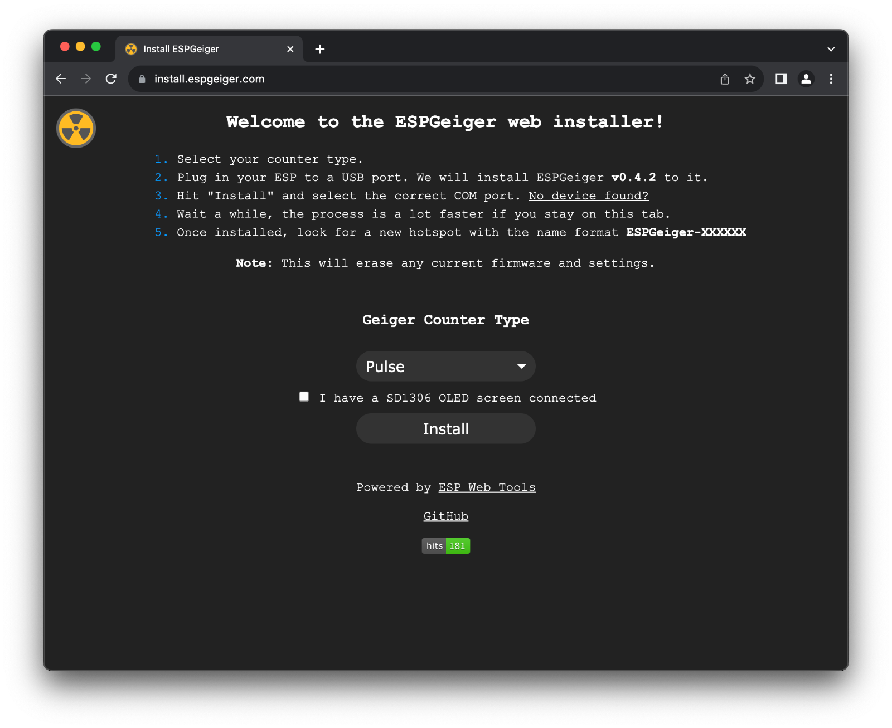
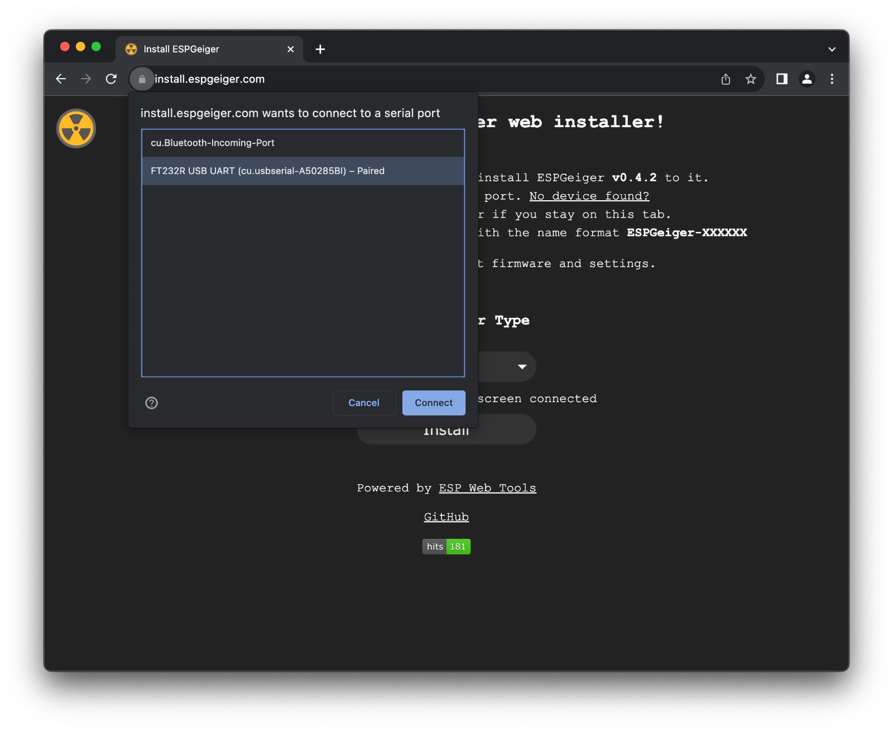
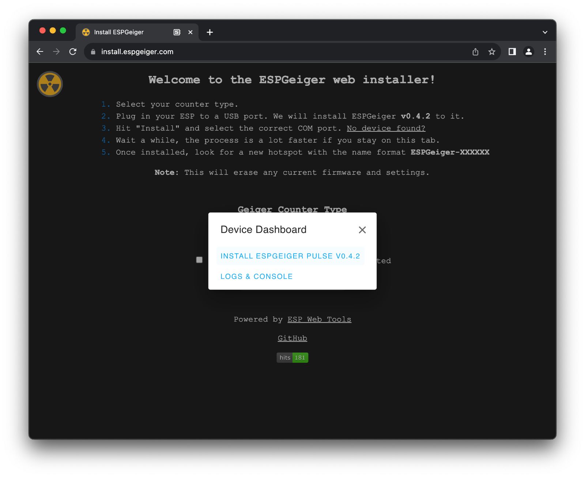
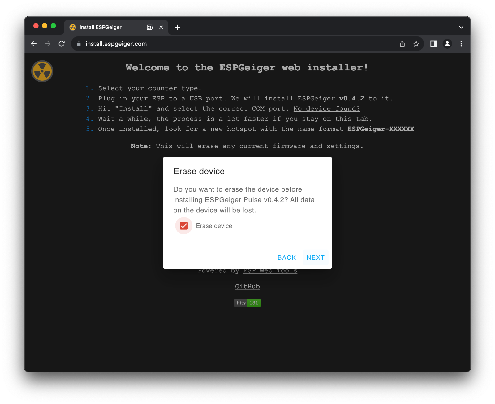
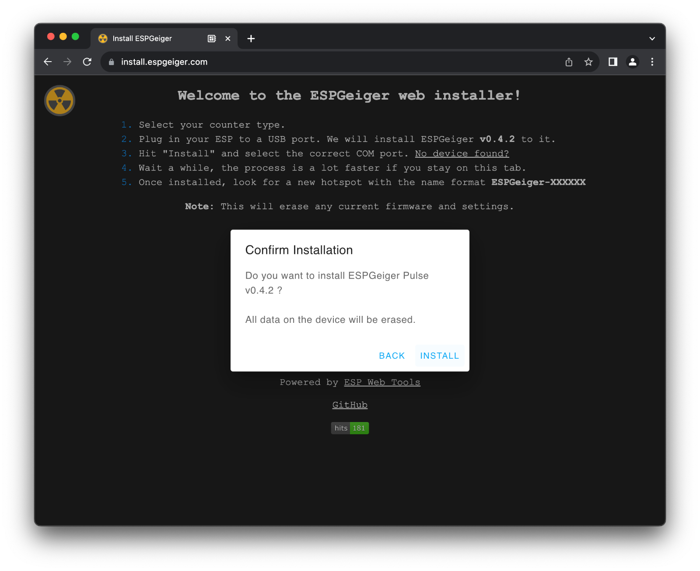
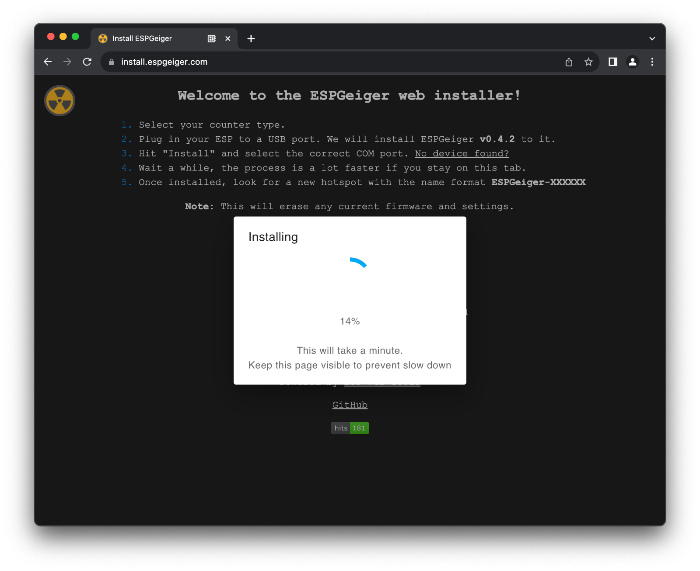

# Web Installer

The web installer at https://install.espgeiger.com/ is the quickest and easiest way to get up and running with ESPGeiger.

The run the web installer requires the PC/Mac version of either Chrome or Edge.

From the Web installer a number of predefined builds can be installed -

## Pulse

Two pulse builds are made available. 

- Pulse
- Pulse - No PCNT (ESP32 only)

## Serial

- GC10
- GC10Next
- MightyOhm

## Hardware

Builds for specific Geiger Counter models and other hardware projects

- ESPGeiger-HW
- CAJOE-IOT GM

## ESPGeiger Log

Firmware versions for the ESPGeiger log, providing Pulse and Serial variants.

- Pulse
- GC10
- GC10Next
- MightyOhm

## Test

Features a number of test builds for various devices.

# Installation

The installation process is powered by [ESP Web Tools](https://esphome.github.io/esp-web-tools/)

Ensure that the relevant drivers are installed for you device. Some information is provided on page if your device is not detected.

1. Select the relevant __Geiger Counter Type__ you wish to install firmware for and where available, if the OLED variant should be used.

2. Connect your ESP device to your PC.

3. Click __Install__

4. Confirm the version to be installed

5. If this is the first install it is recommended to erase the device as well. This will remove any settings.

6. Confirm options

7. Await the install, this can take several minutes

8. Completed. ESPGeiger is now installed. The indication light on the ESP will be lit permanently until the WiFi hotspot is configured.

