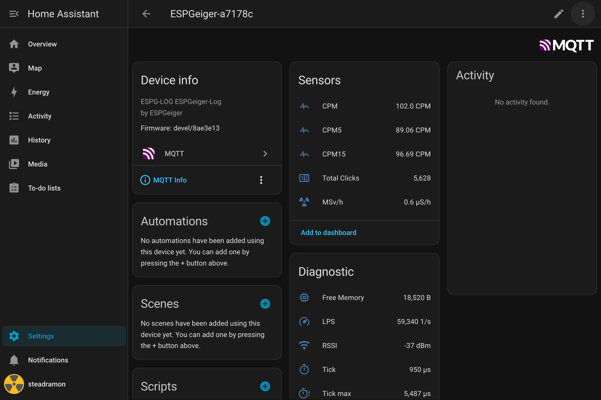

# Home Assistant MQTT Discovery

ESPGeiger automatically integrates into [Home Assistant](https://www.home-assistant.io/) through the use of the [MQTT Discovery](https://www.home-assistant.io/integrations/mqtt/#mqtt-discovery) functions within Home Assistant.

Within Home Assistant MQTT discovery is enabled by default. The default prefix for the discovery topic is `homeassistant`. For information on how to change this in Home Assistant, please see the [Home Assistant Documentation for discovery options](https://www.home-assistant.io/integrations/mqtt/#discovery-options)

The MQTT discovery topic can be adjusted within the ESPGeiger Config pages.

A number of entities are published to the MQTT auto discovery topic, these are detailed below:

| Value | Description |  Example Value | Publish Interval |
|---|---|---|---|
`ESPGeiger‑<device_id> CPM` | Current Counts Per Minute (CPM) value. | `30.0` | 60
`ESPGeiger‑<device_id> CPM5` | Average CPM over the last 5 minutes. | `30.0` | 60
`ESPGeiger‑<device_id> CPM15` | Average CPM over the last 15 minutes. | `30.0` | 60
`ESPGeiger‑<device_id> uSv` | Current microSieverts per hour (μSv) value. | `0.10` | 60