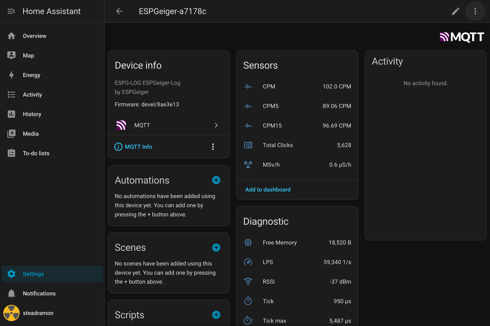

# Home Assistant MQTT Discovery

ESPGeiger automatically integrates into [Home Assistant](https://www.home-assistant.io/) through the use of the [MQTT Discovery](https://www.home-assistant.io/integrations/mqtt/#mqtt-discovery) functions of Home Assistant. This requires ESPGeiger and Home Assistant to be configured to use the same MQTT broker.

Within Home Assistant MQTT discovery is enabled by default. The default prefix for the discovery topic is `homeassistant`. For information on how to change this in Home Assistant, please see the Home Assistant Documentation for [discovery options](https://www.home-assistant.io/integrations/mqtt/#discovery-options).

The MQTT discovery topic can be adjusted within the ESPGeiger [Config pages](/configuration#mqtt-configuration).

## Measurement entities

| Value | Description | Example | Publish Interval |
|---|---|---|---|
| `ESPGeiger-<device_id> CPM` | Current CPM value | `30.0` | 60 s |
| `ESPGeiger-<device_id> CPM5` | 5-minute smoothed CPM | `30.0` | 60 s |
| `ESPGeiger-<device_id> CPM15` | 15-minute smoothed CPM | `30.0` | 60 s |
| `ESPGeiger-<device_id> µSv/h` | μSv/h value | `0.10` | 60 s |
| `ESPGeiger-<device_id> HV` | High-voltage reading — ESPGeiger-HW only | `400.1` | 60 s |
| `ESPGeiger-<device_id> Total Clicks` | Cumulative clicks since boot. | `43200` | 60 s |

## Threshold alerts (binary sensors)

Triggered when CPM crosses the configured warning / alert thresholds. Consumed via `value_template` from `tele/sensor` JSON. Good targets for HA automations (notifications, lights, sirens).

| Value | Description | Device class |
|---|---|---|
| `ESPGeiger-<device_id> Warning` | CPM above configured warning threshold | `problem` |
| `ESPGeiger-<device_id> Alert` | CPM above configured alert threshold | `safety` |
| `ESPGeiger-<device_id> Serial Connected` | Serial counter has reported within the last 60 s. Published only on serial builds — pulse builds have no external peer to monitor. | `connectivity` |

## Diagnostic entities

Appear under the device's **Diagnostic** section in Home Assistant, not the main dashboard.

| Value | Description | Example | Publish Interval |
|---|---|---|---|
| `ESPGeiger-<device_id> tick` | EMA-smoothed `sTickerCB` duration in µs — typical device load | `953` | 60 s |
| `ESPGeiger-<device_id> tick max` | Peak `tick` observed in last 60 s | `4870` | 60 s |
| `ESPGeiger-<device_id> LPS` | Loop iterations per second | `58733` | 60 s |
| `ESPGeiger-<device_id> RSSI` | WiFi signal strength (dBm) | `-37` | 60 s |
| `ESPGeiger-<device_id> Uptime` | Seconds since boot | `120` | 60 s |
| `ESPGeiger-<device_id> Free Memory` | Free heap in bytes | `16928` | 60 s |

## Domoticz Autodiscovery

> From Stable 2022.1 Domoticz MQTT supports Home assistant MQTT Discovery

The Domoticz Autodiscovery Client Gateway is compatible with HomeAssistant autodiscovery. For more information see the [Domoticz wiki](https://www.domoticz.com/wiki/MQTT#Add_hardware_.22MQTT_Auto_Discovery_Client_Gateway.22)
