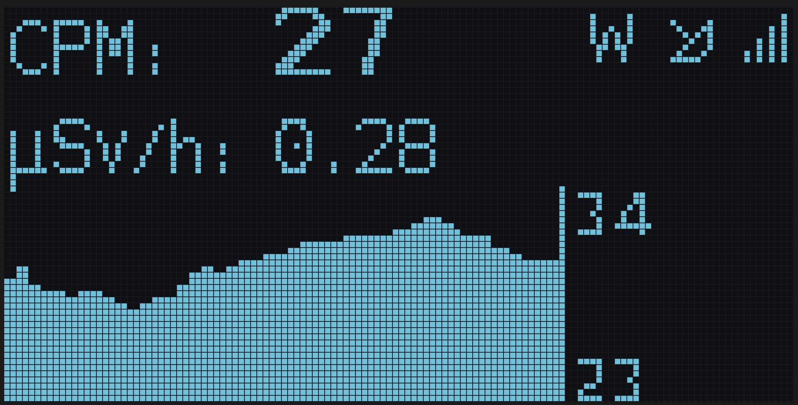

# OLED Display Output

# Push button operations

If the firmware is built with the push button enabled then the OLED will automatically timeout after a pre-determined time. This can be configured within the config pages.

## Single Press

There are several pages of information supplied on the OLED display. If your ESPGeiger device has a push button configured the pages can be scrolled through by a single short click of the push button.

## Longpress

A long press will toggle the OLED screen timeout. The onboard LED will indicate the current state by flashing once for enabled and twice for disabled when the state is changed. On ESPGeiger-HW devices the Beeper reacts in time with the LED.
