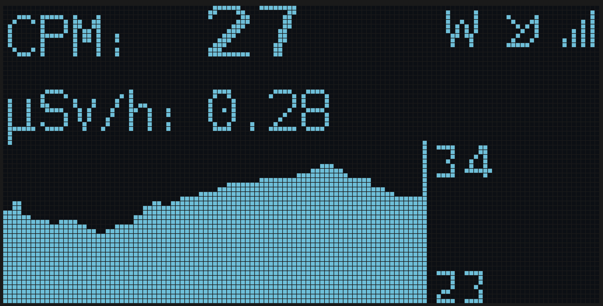

# OLED Display Output

# Display behaviour

Three settings on the **Display** config page control when the OLED is on:

- **Timeout** *(push-button builds only)* - seconds of inactivity before the display turns off after a tap. `0` falls back to the On/Off Time schedule below.
- **On Time / Off Time** - daily schedule; outside the window the display is off. Leave both blank for "always on". Window crosses midnight if `from > to` (e.g. `22:00`–`07:00`).
- **Brightness** - 0–100 %.

On builds **without** a push button, only the schedule applies.

On builds **with** a push button, the resolution order is:

1. Long-press override active → display always on.
2. Otherwise, if Timeout > 0 → on for Timeout seconds after each tap.
3. Otherwise (Timeout = 0) → follow On/Off Time schedule, with a 30-second wake window after any tap so you can check readings during off-hours.

# Push-button operations

## Single press

Cycles through the information pages. If the display is off, the first tap turns it on and shows page 1.

## Long press

Toggles the always-on override. The onboard LED flashes once when the override turns *on* (display will follow Timeout/schedule normally), twice when it turns *off* (display stays on permanently). On ESPGeiger-HW devices the beeper reacts in time with the LED.

# Pin configuration

Builds without `OLED_PINS_BLOCKED` expose the OLED I2C pins as runtime prefs (**I2C SDA Pin** and **I2C SCL Pin**) on the same Display config page. Changes trigger a reboot to take effect. Purpose-built kits set `OLED_PINS_BLOCKED` at compile time so the pins stay fixed.

# Browser screen viewer

OLED builds expose a live preview of the framebuffer at **`/screen`**. The page redraws ~5 times a second from a raw fetch of the 1024-byte framebuffer, picks a phosphor tint, and accepts virtual button taps - useful for headless debugging, remote demos, or screenshots without a phone camera. The view is rendered even on builds compiled with display support but no display attached, so you can build a UDP-receiver build with `esp8266oled_udp` and still see what the panel *would* show.

| Path | Returns | Use |
|---|---|---|
| `/screen` | HTML viewer page | Interactive view in the browser |
| `/screen.bin` | Raw 1024-byte framebuffer | Direct decode (column-packed, 128x64 1bpp) |
| `/screen.bmp` | Transposed PNG-alike | One-shot screenshot |
| `/screen/tap` | `OK` | Virtual short press of the user button (push-button builds) |

The viewer remembers your phosphor tint choice in `localStorage`. The `/screen.bin` endpoint is what you want if you're scripting against the device.
