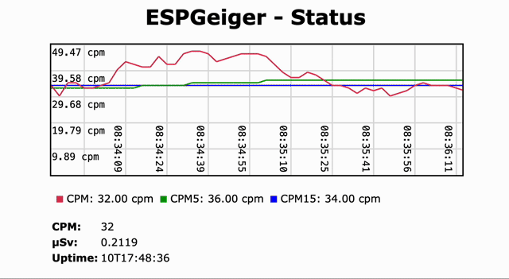

# Web Portal

ESPGeiger comes with a built-in Web Portal, allowing you to easy configuration of your device, as well as giving the ability to view the live readings and status output on your laptop or mobile device.

