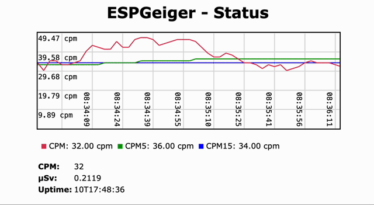

# Web Portal

ESPGeiger comes with a built-in Web Portal, allowing you to easy configuration of your device, as well as giving the ability to view the live readings and status output on your laptop or mobile device.



## Configuring your device

The main page has buttons to reach each area of configuration:

* **Config** — all general device and output settings. See the [Configuration reference](/configuration) for the full list of options, value ranges and defaults.
* **NTP Config** — time zone and NTP server settings. See [NTP Configuration](/configuration/ntp).
* **HV Config** — high-voltage tuning for ESPGeiger-HW boards. See [HV Configuration](/configuration/hv).

## Console log

The Status page includes a live console tail of the device's log. Timestamps follow two formats:

* `HH:MM:SS` — wall-clock time (device has synced to NTP and applied its configured timezone). The web UI converts these to your browser's local timezone so they line up with the graph.
* `HH:MM:SS*` — uptime since boot. The trailing asterisk signals that NTP hasn't synced yet; the time is not wall-clock and the browser should not timezone-shift it. Once NTP syncs, new lines appear without the asterisk.

In [offline mode](/configuration/offlinemode) there is no wall-clock and no asterisk — timestamps are plain uptime. The web portal itself isn't reachable when WiFi is disabled, but the same format appears on the serial console.

## HTTP endpoints

The ESPGeiger web portal exposes a number of HTTP endpoints that are useful for integration, scripting, or simply linking to directly from a browser.

| Path | Description |
|---|---|
| `/` | Main home page |
| `/status` | Detailed device status page (live readings, uptime, build info) |
| `/hist` | Rolling CPM history view |
| `/json` | Machine-readable status snapshot — see [JSON Endpoint](/output/integrations#json-endpoint) |
| `/lastdata` | GeigerLog-compatible CSV line — see [GeigerLog](/output/integrations#geigerlog) |
| `/about` | Build, hardware and module identity (useful for support / debugging) — see below |
| `/outputs` | State of the configured third-party output modules — see below |
| `/ntp` | NTP configuration page |
| `/hv` | High-voltage tuning page (ESPGeiger-HW builds only) |
| `/cpm?v=N` | Set target CPM on test geiger builds — see [Test build CPM setter](#test-build-cpm-setter) |
| `/restart` | Reboots the device — use with care |

For the `/json` response schema and examples of integrating `/json` or `/lastdata` with external tools (GeigerLog, Home Assistant, Prometheus, InfluxDB, Node-RED, Grafana), see [Integrations](/output/integrations).

### `/outputs` response

Returns a JSON object keyed by module name, describing the state of each configured third-party output. Only modules that are **enabled** in the Config page appear — unconfigured or disabled modules are omitted. An empty object `{}` means no third-party outputs are active.

Possible keys: `mqtt`, `radmon`, `thingspeak`, `gmc`, `webhook`.

Example:

```json
{
  "mqtt":       {"ok":true,  "age":42},
  "radmon":     {"ok":true,  "age":17},
  "thingspeak": {"ok":false, "age":91},
  "gmc":        {"ok":true,  "age":230},
  "webhook":    {"ok":false, "age":null}
}
```

| Field | Meaning |
|---|---|
| `ok` | `true` if the last submission was accepted by the remote service. For MQTT this reflects the live connection plus a successful recent publish. |
| `age` | Seconds since the last submission attempt completed, or `null` if the module is enabled but has not yet attempted a submission (e.g. just after boot). |

This is intended as a lightweight health check — useful for local dashboards, scripts, or Home Assistant REST sensors that want to know whether a given remote integration is working without subscribing to MQTT or scraping the logs.

### `/about` response

Static identity information about the device and firmware, plus the list of compiled-in modules. Useful for support tickets and remote inventory. Things that change at runtime (uptime, memory, RSSI) live in `/json` instead.

Example:

```json
{
  "ver": "0.8.0",
  "git": "06a2d9d",
  "env": "espgeigerlog",
  "date": "Apr 15 2026 12:34:56",
  "chip": "ESP8266",
  "mac": "AABBCCDDEEFF",
  "host": "ESPGeiger-a1b2c3",
  "g_mod": "genpulse",
  "g_type": "pulse",
  "g_test": false,
  "g_pcnt": true,
  "modules": ["disp","neopx","button","ntp","mqtt","radmon","whook","sercmd","serout"]
}
```

| Field | Meaning |
|---|---|
| `ver` | Firmware version (release) |
| `git` | Short git commit the firmware was built from |
| `env` | PlatformIO build environment name (e.g. `espgeigerlog`, `esp32oled_pulse`) |
| `b_date` | Build timestamp (compile-time `__DATE__ __TIME__`) |
| `chip` | Chip model reported by the framework (`ESP8266` / `ESP32` / `ESP32-S2` etc.) |
| `mac` | Device MAC address |
| `host` | Configured hostname |
| `g_mod` | Geiger model name set by the build / config. For serial builds this identifies the protocol (`GC10`, `GC10Next`, `MightyOhm`, `ESPG`). |
| `g_type` | Counter input type: `"pulse"`, `"serial"`, or `"none"` (pure test build with no hardware input) |
| `g_test` | `true` if the build is a test / simulation variant (generates pulses internally) |
| `g_pcnt` | `true` if the build uses the ESP32 PCNT hardware counter for pulse counting (false on ESP8266 builds, and on ESP32 builds compiled with `-D IGNORE_PCNT`) |
| `modules` | List of module identifiers compiled into this firmware |

### Test build CPM setter

Test builds (any target whose `GEIGER_TYPE` has the test bit set, e.g. `espgeigerlog_test`, `esp32_testpulse`, `espgeigerlite_testpulse`) expose `/cpm` so you can steer the simulated counter from a browser or script. This is useful for exercising downstream integrations (MQTT, Thingspeak, alert thresholds, dashboards) without needing a radiation source.

```
GET /cpm?v=<target_cpm>
```

| Parameter | Meaning |
|---|---|
| `v` | Target CPM. Must be a positive integer; values ≤ 0 are ignored. |

The internal test counter retargets to generate pulses at the given rate (Poisson-distributed for pulse-type test builds). Response body is `OK` on success.

Example — set target to 150 CPM:

```
curl http://192.168.1.100/cpm?v=150
```

The endpoint is absent from non-test builds.
